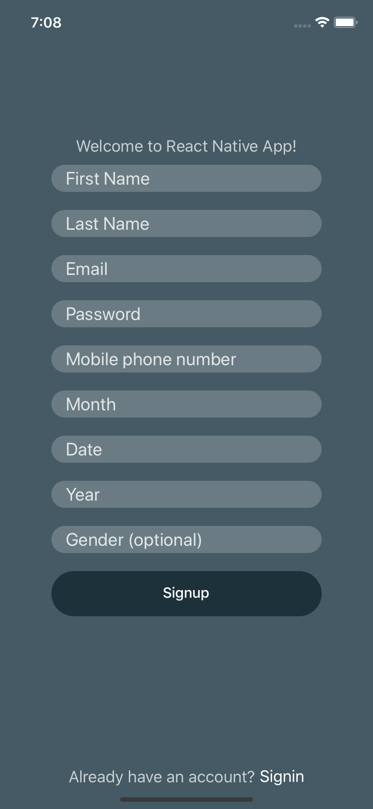

# ReactNativeApp

This is sample React Native app written to validate forms in real time using Redux. It is based on the information required when a user signs up for a new [Yahoo](https://login.yahoo.com/account/create) account.


## Screenshot



## Getting Started

1. Make sure you have node, npm and react-native-cli installed. If not please check this guide: [React-Native Guide](https://reactnative.dev/docs/0.61/getting-started).

2. Clone the repo:
  ```
  git clone https://github.com/shaurya16/ReactNativeApp
  ```
3. Install npm packages:
  ```
  npm install
  ```
4. The project is built on iOS. Please make sure you have xcode and its cli tools installed. Build the project for ios:
  ```
  react-native run-ios
  ```
